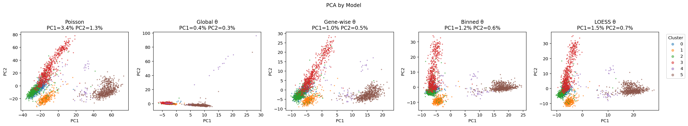
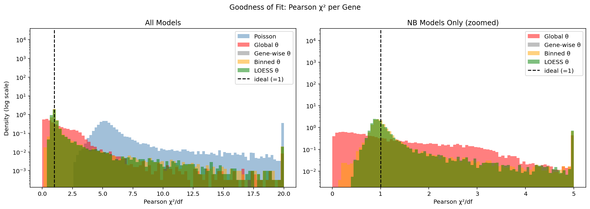
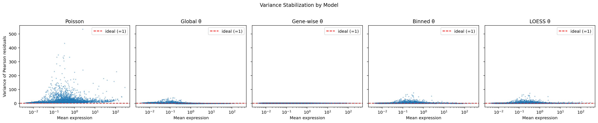

# Regularizing Dispersion Estimates in Negative Binomial Models for scRNA-seq Analysis

This project evaluates different regularization strategies for dispersion parameter estimates used in Negative Binomial models for single-cell RNA sequencing (scRNA-seq) data.
The analysis compares the performance of global, gene-wise, binned, and LOESS regularization methods on a PBMC dataset and evaluates their impact on model fit and downstream clustering.

## Key Results
- Binned and LOESS regularization strategies reduced poorly fit genes from 26.5% to 11%
- Demonstrated improved variance stabilization using binned and LOESS regularization strategies
- Showed clearer PCA cluster separation using binned and LOESS approaches
- Gene-wise dispersion estimation strategy leads to overfitting

## Tech Stack
- Python
- NumPy
- Pandas
- Scanpy
- Matplotlib
- Statistical Modelling
- PCA
- Negative Binomial Modelling

## Figures

### PCA of Residuals
Regularized models produced clearer separation of cell populations while suppressing noise and outliers.

<p align="center">
  
</p>

---

### Chi-Squared Goodness-of-Fit Comparison
Binned and LOESS-based dispersion estimation reduced poorly fit genes compared to Poisson and global dispersion approaches

<p align="center">
  
</p>

---
### Variance Stabilization Across Models
Gene-specific disperison models produced Pearson residual variances closer to 1, demonstrating improved variance stabilization 
<p align="center">
  
</p>


## Repository Structure
```text
.
├── scRNAseq_dispersion_analysis.py
├── requirements.txt
├── figures/
└── report/
    └── Final_Project.pdf
```
- `scRNAseq_dispersion_analysis.py` contains preprocessing, modelling, evaluation, and visualization workflows
- `figures/` contains generated plots used in the report and README
- `report/` contains the final project write-up
